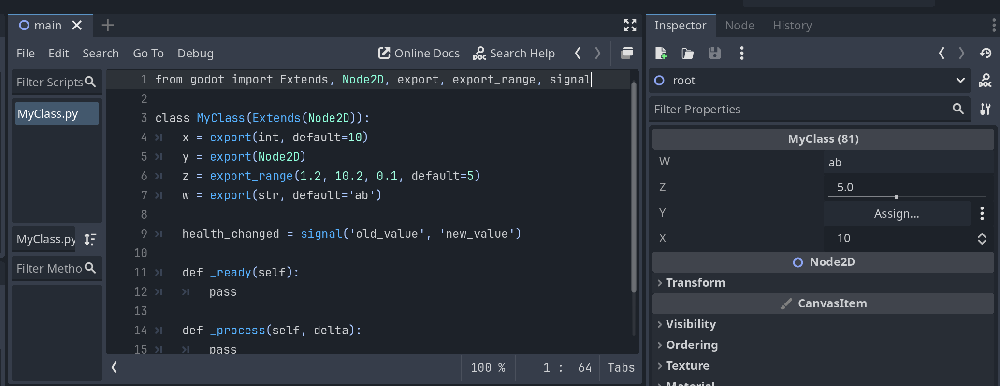

# godot-pocketpy


## How to use
Download the artifact `godot-pocketpy` from Github Actions page.
https://github.com/pocketpy/godot-pocketpy/actions

Unzip it into your Godot project's `addons` folder, and then open the Godot editor. Make sure your Godot version is v4.4 or later.

Create a special folder `site-packages` in your project root with a `.gdignore` file. This is where you can put your Python modules.
When you run `import` statements, `site-packages` will be searched.

You may also want to create a `scripts` folder to store Godot-based Python scripts, which can be attached to nodes in your Godot scenes.
Please note that any Python scripts outside of `site-packages` will be compiled by Godot, so they must derive from `godot.Node` and the class name must match the filename.

Python scripts in `site-packages` must not be compiled, which is why you need to add a `.gdignore` file in the `site-packages` folder.

The basic structure of your project should look like this:

```
- addons
    - godot-pocketpy
        - bin
        - typings
- site-packages
    - .gdignore
    - some_library
        - __init__.py
        - test.py
- scripts
    - MyClass.py
- project.godot
```

To create a Godot-based Python script, open "Attach Node Script" dialog, select Python as the language with the "Node: Default" template, and enter the script name (e.g., `MyClass.py`).




## Dev Instructions

To generate the stub files, run:

```
python -m stubgen
```

To build the project, run:

```
python build.py
```
